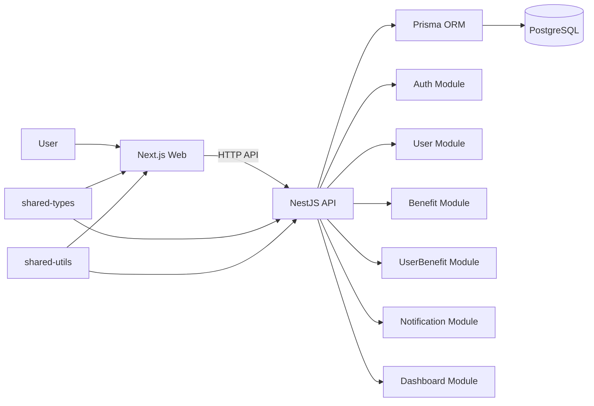
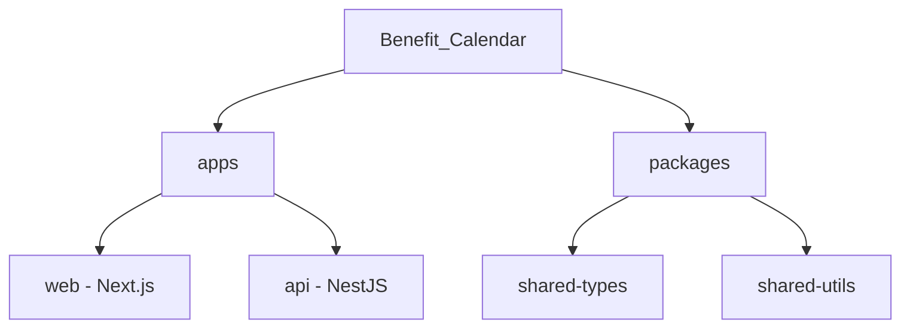
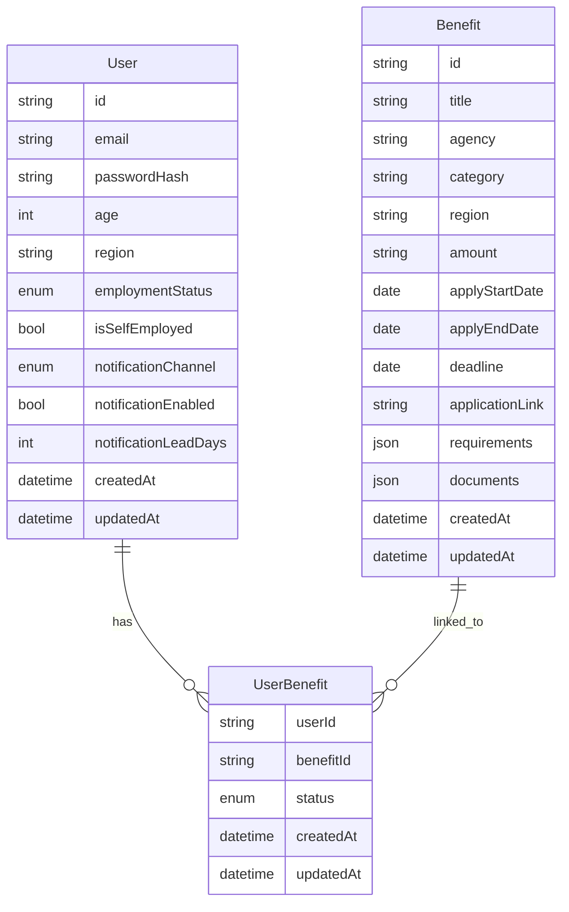

# Benefit Calendar

혜택 일정과 신청 상태를 한곳에서 관리하기 위한 **혜택 캘린더 서비스**입니다.  
모노레포 구조에서 **Next.js 웹 애플리케이션**과 **NestJS API 서버**를 분리하고, **Prisma + PostgreSQL** 기반으로 사용자·혜택·신청 상태 데이터를 관리하도록 설계했습니다.

## Overview

이 프로젝트는 다음 문제를 풀기 위해 시작했습니다.

- 사용자가 자신에게 맞는 혜택 일정을 한눈에 확인할 수 있어야 함
- 혜택별 신청 마감일과 준비 상태를 지속적으로 관리할 수 있어야 함
- 웹과 API를 분리하면서도 공통 타입/유틸을 재사용할 수 있어야 함

이를 위해 `pnpm workspace`와 `Turborepo` 기반 모노레포를 구성하고,  
웹(`apps/web`)과 API(`apps/api`)를 독립적으로 개발·배포할 수 있는 구조로 만들었습니다.

## Architecture



### Project Structure



## Backend Design

NestJS API는 다음 구성을 기반으로 동작합니다.

- **Global Prefix**: `api/v1`
- **CORS** 활성화
- **ValidationPipe** 기반 요청 검증
- 전역 예외 필터 / 응답 인터셉터 적용
- **Swagger** 문서 제공: `/api/docs`

### Domain Model



## Main Features

현재 구조 기준으로 프로젝트가 다루는 핵심 영역은 다음과 같습니다.

| 모듈 | 설명 |
|------|------|
| **Auth** | 사용자 인증 및 JWT 기반 인증 처리 |
| **User** | 사용자 정보 관리 |
| **Benefit** | 혜택 정보 조회 및 관리 |
| **UserBenefit** | 사용자별 혜택 저장/준비/신청/수령 상태 관리 |
| **Notification** | 알림 설정 및 리마인드 확장 기반 |
| **Dashboard** | 사용자 맞춤 요약 정보 제공 |

## Tech Stack

### Web

- Next.js 14
- React 18
- TypeScript
- Tailwind CSS

### API

- NestJS 10
- Prisma
- PostgreSQL
- JWT / Passport
- Swagger
- Jest

### Monorepo / Tooling

- pnpm workspace
- Turborepo
- TypeScript

## API Bootstrap

API 서버는 다음과 같이 초기화됩니다.

- `api/v1` 경로 prefix 설정
- Swagger 문서 자동 생성
- ValidationPipe로 DTO 검증
- HttpExceptionFilter / ResponseInterceptor 전역 적용

이런 구성을 통해 API 응답 형식과 에러 처리를 일관되게 유지하도록 설계했습니다.

## Project Goals

이 프로젝트에서 집중한 부분은 다음과 같습니다.

- 웹과 API를 분리한 모노레포 구조 설계
- 공통 타입/유틸 재사용을 통한 생산성 개선
- 혜택 일정과 사용자 상태를 구조적으로 관리할 수 있는 도메인 모델링
- Swagger, ValidationPipe, Prisma를 활용한 유지보수 가능한 서버 구조 구성

## Scripts

### Root

```bash
pnpm dev         # 전체 개발 서버 시작
pnpm build       # 전체 빌드
pnpm lint        # 전체 린트
pnpm test        # 전체 테스트
pnpm db:generate # Prisma 클라이언트 생성
pnpm db:migrate  # DB 마이그레이션
pnpm db:seed     # DB 시드 데이터
```

### Web / API

```bash
pnpm --filter @benefit-calendar/web dev    # Web 개발 서버
pnpm --filter @benefit-calendar/api dev    # API 개발 서버
pnpm --filter @benefit-calendar/api test   # API 테스트
```

## Development Notes

- Web과 API를 분리해 기능별 책임을 분명히 했습니다.
- `shared-types`, `shared-utils`를 통해 웹/API 간 중복을 줄일 수 있도록 구성했습니다.
- Prisma 스키마에서 User, Benefit, UserBenefit 관계를 명확히 두어, 사용자 맞춤 혜택 관리 흐름을 모델링했습니다.

## Future Improvements

- 혜택 추천 로직 고도화
- 알림 채널 확장
- 사용자 조건 기반 필터링 강화
- 대시보드 시각화 개선
- 테스트 커버리지 및 e2e 시나리오 확장
